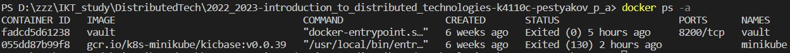

University: [ITMO University](https://itmo.ru/ru/)  
Faculty: [FICT](https://fict.itmo.ru)  
Course: [Introduction to distributed technologies](https://github.com/itmo-ict-faculty/introduction-to-distributed-technologies)  
Year: 2022/2023  
Group: K4110c  
Author: Pestryakov Pavel Andreevich  
Lab: Lab1  
Date of create: 19.07.2023  
Date of finished: 20.07.2023  

---

## Лабораторная работа №1 "Установка Docker и Minikube, мой первый манифест."

### Описание
Это первая лабораторная работа в которой вы сможете протестировать Docker, установить Minikube и развернуть свой первый "под".

### Цель работы
Ознакомиться с инструментами Minikube и Docker, развернуть свой первый "под".

### Ход работы
- Установить Docker на рабочий компьютер

- Установить Minikube используя [оригинальную инструкцию](https://minikube.sigs.k8s.io/docs/start/)

- После установки вам необходимо развернуть minikube cluster

>

- Развернем Minikube cluster:

>

- Запустим dashboard командой:
```bash
minikube dashboard
```
- Переходим по адресу и получаем страницу:
>

- Для первого манифеста выбран образ HashiCorp Vault, более подробно можете почитать [тут](https://www.vaultproject.io).

Проверим наличие образа vault:

>

Создаем контейнер на основе образа vault и проверяем его наличие:

>

- Пишем манифест для развертывания "пода" HashiCorp Vault, и при этом прокидываем внутрь порт **8200**
> ВАЖНО! Вам не надо самим собирать контейнер, вы можете его взять [тут](https://hub.docker.com/_/vault/)

- Создаем файл vault_first.yml и прописываем манифест для нашего пода:

```yaml
apiVersion: v1 # Версия API Kubernetes
kind: Pod # Объект типа "Pod"
metadata:
  name: vault-pod # Идентификация имени пода
  labels:
    app: vault # Для идентификации объекта метка "vault" нашего пода
spec:
  containers:
  - name: vault # Имя контейнера
    image: hashicorp/vault:latest # Образ контейнера внутри пода с тегом "latest"
    ports:
    - containerPort: 8200 # Прокидываем порт
```

В папке с манифестом выполняем команду: `kubectl create -f vault_first.yml`.

И проверяем, появился ли наш Pod: `kubectl get pods`.

>

- Создаем сервис для доступа к Pod:
 ```bash
 minikube kubectl -- expose pod vault-pod --type=NodePort --port=8200
 ```

 - Перенаправляем трафик с Pod на локальный:
```bash
minikube kubectl -- port-forward service/vault-pod 8200:8200
```

Теперь мы можем перейти на страницу авторизации Vault по адресу `http://localhost:8200`.

Нам необходимо авторизоваться по токену. Для поиска `Root Token` можно воспользоваться командой:
```bash
minikube kubectl -- logs service/vault-pod
```

- После авторизации:
>

- Для остановки minikube cluster воспользуемся командой:

```bash
minikube stop
```
---
-Схема организации контейнера и сервиса:

>

**Выводы:**  
- Установлены Docker, Minikube; развернут кластер Minikube.
- Создан манифест, который поднимает хранилище секретов Vault по порту 8200. Доступ к этому хранилищу осуществляется с помощью токена, который можно узнать в логах контейнера.
