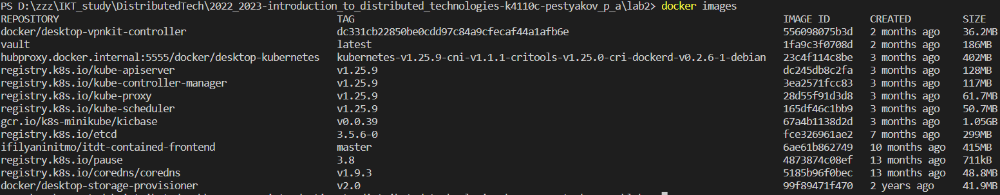
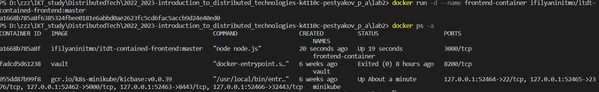
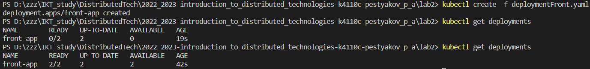
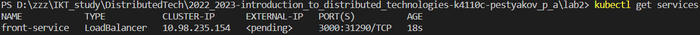
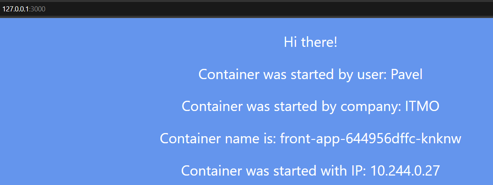
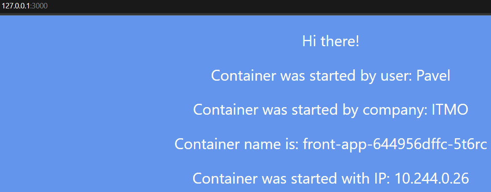
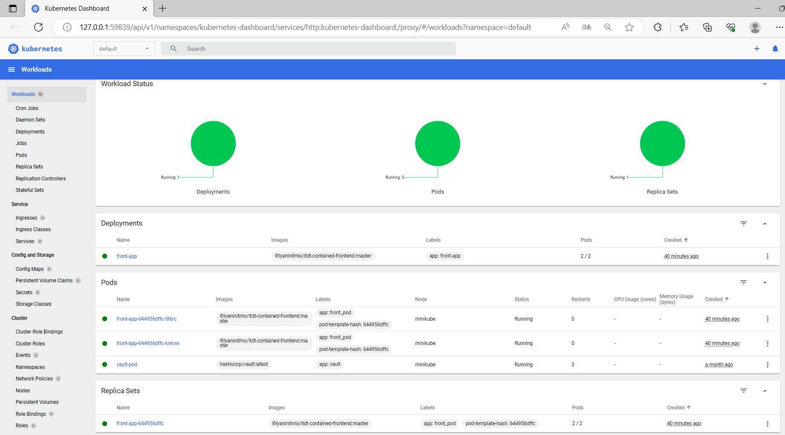
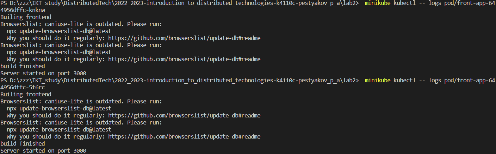
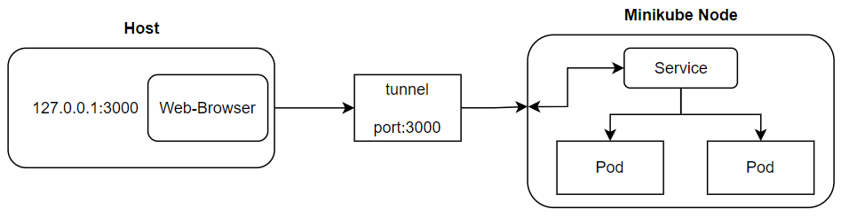

University: [ITMO University](https://itmo.ru/ru/)  
Faculty: [FICT](https://fict.itmo.ru)  
Course: [Introduction to distributed technologies](https://github.com/itmo-ict-faculty/introduction-to-distributed-technologies)  
Year: 2022/2023  
Group: K4110c  
Author: Pestryakov Pavel Andreevich  
Lab: Lab2  
Date of create: 20.07.2023  
Date of finished: 21.07.2023  

---

## Лабораторная работа №2 "Развертывание веб сервиса в Minikube, доступ к веб интерфейсу сервиса. Мониторинг сервиса."

### Описание

В данной лабораторной работе вы познакомитесь с развертыванием полноценного веб сервиса с несколькими репликами. 

### Цель работы

Ознакомиться с типами "контроллеров" развертывания контейнеров, ознакомится с сетевыми сервисами и развернуть свое веб приложение. 

- Вам необходимо создать `deployment` с 2 репликами контейнера [ifilyaninitmo/itdt-contained-frontend:master](https://hub.docker.com/repository/docker/ifilyaninitmo/itdt-contained-frontend) и передать переменные в эти реплики: `REACT_APP_USERNAME`, `REACT_APP_COMPANY_NAME`.

- Создать сервис через который у вас будет доступ на эти "поды". Выбор типа сервиса остается на ваше усмотрение. 

- Запустить в `minikube` режим проброса портов и подключитесь к вашим контейнерам через веб браузер.

- Проверьте на странице в веб браузере переменные `REACT_APP_USERNAME`, `REACT_APP_COMPANY_NAME` и `Container name`. Изменяются ли они? Если да то почему?

- Проверьте логи контейнеров, приложите логи в отчёт.

### Ход работы

Запустим minikube:

```bash
minikube start
```

Загрузим образ:

```bash
docker pull ifilyaninitmo/itdt-contained-frontend:master
```

Проверим, что загрузился:

>

Теперь можно создать контейнер на основе загруженного образа:

```bash
docker run -d --name frontend-container ifilyaninitmo/itdt-contained-frontend:master
```

>

- Необходимо написать манифест для развертывания. По условию, должно быть 2 pod'a, значит свойство `replicas: 2`

```bash
apiVersion: apps/v1
kind: Deployment
metadata:
  name: front-app
  labels:
    app: front-app
spec:
  replicas: 2 # кол-во pod
  selector: # для выбора pod'ов 
    matchLabels:
      app: front_pod # метка для подов, управляемых под этим развертыванием
  template:
    metadata:
      labels:
        app: front_pod
    spec:
      containers: # определяем список контейнеров, развернутых внутри пода
      - name: front-container
        image: ifilyaninitmo/itdt-contained-frontend:master
        ports:
        - containerPort: 3000
        env:
        - name: REACT_APP_USERNAME
          value: Pavel
        - name: REACT_APP_COMPANY_NAME
          value: ITMO
```

В объекте `template` описываем шаблон pod'a. Здесь метка `front-pod`, по которой будем обращаться к нужным pod'ам. Порт 3000. Также задаем переменные окружения `REACT_APP_USERNAME` = `Pavel` и `REACT_APP_COMPANY_NAME` = `ITMO`.

Развернем и проверим:
>

Здесь видно, что при первой проверке, pod'ы не были готовы и надо подождать некоторое время.

- Напишем манифест для сервиса.

```bash
apiVersion: v1
kind: Service
metadata:
  name: front-service
  labels:
    app: frontend
spec:
  ports:
    - protocol: TCP
      port: 3000
      targetPort: 3000
  selector:
    app: front_pod
  type: LoadBalancer   # позволяет использовать внешний балансировщик нагрузки для доступа к сервису извне кластера   
```

Имя `front-service`, используем протокол `TCP`, открываем порт 3000, а также с помощью `targetPort` направляем трафик с открытого порта сервиса на порт 3000 внутри подов, которые имеют метку `app: front_pod`.

>

- Теперь необходимо пробросить порты и посмотреть результат на веб-странице `127.0.0.1:3000`.

Здесь возник вопрос в том, почему при пробрасывании командой `minikube kubectl -- port-forward service/front-service 3000:3000` обращение всегда идет только к 1-ому pod'у...

В этом вопросе мне помог разобраться чатик gpt:

Оказывается, эта команда устанавливает прямое (порт-по-порту) соединение с сервисом `front-service` через API сервер Kubernetes. Она пробрасывает порты между локальной машиной, на которой выполняется kubectl, и одним из pod'ов, выбранных случайным образом из списка соответствующих сервису `front-service` pod'ов. 

`port-forward` просто пробрасывает порт для одного из доступных подов в кластере, и по умолчанию он пробрасывает на первый доступный под.

Существует команда `minikube tunnel`:  
Эта команда создает виртуальный бридж снаружи кластера Kubernetes, позволяя внешним клиентам обращаться к сервисам и подам внутри кластера. `tunnel` перенаправляет трафик кластера на виртуальный бридж, а затем кластер распределяет трафик между доступными pod'ами, соответствующими сервису `front-service`. Это происходит на уровне сети, и поэтому запросы будут распределены поочередно на все pod'ы, соответствующие сервису.

>

>

Теперь мы видим разные ip адреса и имена наших 2-х подов, которые сменяют друг друга раз в некоторое время.

Посмотрим на `minikube dashboard`:

>

- Просмотрим логи:

>

Возникает `warning`, который меня озадачил. Предлагаемые варианты обновления db почему-то не увенчались успехом.  
~~ну, варнинг, не ерор, соответственно фича...~~

### Схема:

>

**Выводы:**  
- Развернут образ посредством написанного манифеста типа `Deployment`;
- Написан манифест типа `Service` для обращения к доступным pod'ам;
- В результате проброса обнаружено, что сервис поочередно обращается к каждому из двух доступных pod'ов.
