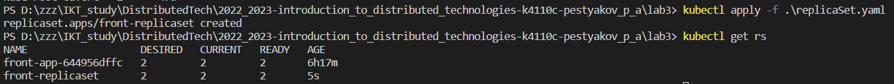
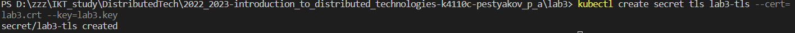

University: [ITMO University](https://itmo.ru/ru/)  
Faculty: [FICT](https://fict.itmo.ru)  
Course: [Introduction to distributed technologies](https://github.com/itmo-ict-faculty/introduction-to-distributed-technologies)  
Year: 2022/2023  
Group: K4110c  
Author: Pestryakov Pavel Andreevich  
Lab: Lab3  
Date of create: 21.07.2023  
Date of finished: 22.07.2023  

---

## Лабораторная работа №3 "Сертификаты и "секреты" в Minikube, безопасное хранение данных."

### Описание

В данной лабораторной работе вы познакомитесь с сертификатами и "секретами" в Minikube, правилами безопасного хранения данных в Minikube.

### Цель работы

Познакомиться с сертификатами и "секретами" в Minikube, правилами безопасного хранения данных в Minikube.

- Вам необходимо создать configMap с переменными: REACT_APP_USERNAME, REACT_APP_COMPANY_NAME.

- Вам необходимо создать replicaSet с 2 репликами контейнера ifilyaninitmo/itdt-contained-frontend:master и используя ранее созданный configMap передать переменные REACT_APP_USERNAME, REACT_APP_COMPANY_NAME .

- Включить minikube addons enable ingress и сгенерировать TLS сертификат, импортировать сертификат в minikube.

- Создать ingress в minikube, где указан ранее импортированный сертификат, FQDN по которому вы будете заходить и имя сервиса который вы создали ранее.

- В hosts пропишите FQDN и IP адрес вашего ingress и попробуйте перейти в браузере по FQDN имени.

- Войдите в веб приложение по вашему FQDN используя HTTPS и проверьте наличие сертификата.

### Ход работы

- Создадим `ConfigMap`

Для начала запустим `minikube start`.
Пример манифеста можно найти в [официальной документации](https://kubernetes.io/docs/concepts/configuration/configmap/) k8s.

```bash
apiVersion: v1
kind: ConfigMap
metadata:
  name: front-configmap
data:
  react_app_user_name: "Pavel"
  react_app_company_name: "ITMO"
```

Ключами выступают `react_app_user_name` и `react_app_company_name`, значения `Pavel` и `ITMO`, соответственно.

>

- Создадим `ReplicaSet`

[Пример манифеста](https://kubernetes.io/docs/concepts/workloads/controllers/replicaset/) для `ReplicaSet` с документации k8s.

```bash
apiVersion: apps/v1
kind: ReplicaSet
metadata:
  name: front-replicaset
  labels:
    app: lab3app
spec:
  replicas: 2
  selector:
    matchLabels:
      app: lab3app
  template:
    metadata:
      labels:
        app: lab3app
    spec:
      containers:
      - name: front-container
        image: ifilyaninitmo/itdt-contained-frontend:master
        ports:
        - containerPort: 3000
        env:
        - name: REACT_APP_USERNAME
          valueFrom:
            configMapKeyRef:
              name: front-configmap
              key: react_app_user_name
        - name: REACT_APP_COMPANY_NAME
          valueFrom:
            configMapKeyRef:
              name: front-configmap
              key: react_app_company_name
```
Здесь переменные окружения `REACT_APP_USERNAME` и `REACT_APP_COMPANY_NAME`, значения которых определены в `ConfigMap`. Обращаемся к `front-configmap` по соответствующим ключам.

>

- Создадим `Service`

Для ресурса `Ingress` необходим манифест сервиса.

```bash
apiVersion: v1
kind: Service
metadata:
  name: front-service
  labels:
    app: lab3app
spec:
  type: NodePort
  selector:
    app: lab3app
  ports:
    - protocol: TCP
      port: 3000
      targetPort: 3000
      nodePort: 31313 # Диапазон 30000 - 32767
```

Поскольку `Ingress` работает с сервисами типа `nodePort` или `LoadBalancer`, явно указал в сервисе тип.

>

- TLS

TLS в Ingress Controller: Ingress Controller управляет входящим трафиком в кластер и обеспечивает обработку запросов по определенным правилам. Minikube также может включать Ingress Controller с поддержкой TLS, позволяя обеспечить защищенный доступ к веб-приложениям, используя сертификаты TLS. 

>

- Secret

Secret содержит небольшое количество конфиденциальных данных, таких как пароль, токен или ключ.

>

Проверим создался ли:

>

- Ingress

`Ingress` в Kubernetes - это объект, который управляет входящим сетевым трафиком и обеспечивает доступ к `Services` внутри кластера. `Ingress` предоставляет механизм для настройки маршрутизации внешнего трафика на pod'ы внутри кластера на основе правил, определенных в самом `Ingress`.

Сперва его надо подключить:

>

[Пример манифеста](https://kubernetes.io/docs/concepts/services-networking/ingress/) для написания `Ingress` с официальной документации k8s.

```bash
apiVersion: networking.k8s.io/v1
kind: Ingress
metadata:
  name: front-ingress
spec:
  tls:
  - hosts:
      - lab3.pavel
    secretName: lab3-tls
  rules:
  - host: lab3.pavel
    http:
      paths:
      - path: /
        pathType: Prefix
        backend:
          service:
            name: front-service
            port:
              number: 3000
```
Проверим наличие:
>

Теперь переходим по указанной ссылке, предварительно перенаправим трафик командой: `minikube tunnel`.

>


### Схема

>

**Выводы:**  
- Написаны манифесты: `ConfigMap`, `ReplicaSet`, `Ingress`, `Service`;
- Сгенерирован `TLS` сертификат;
- Проверка в веб-приложении показала, что при переходе по указанному FQDN используя HTTPS, указан созданный сертификат.