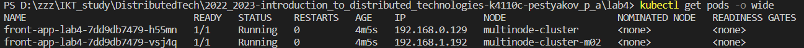

University: [ITMO University](https://itmo.ru/ru/)  
Faculty: [FICT](https://fict.itmo.ru)  
Course: [Introduction to distributed technologies](https://github.com/itmo-ict-faculty/introduction-to-distributed-technologies)  
Year: 2022/2023  
Group: K4110c  
Author: Pestryakov Pavel Andreevich  
Lab: Lab4  
Date of create: 22.07.2023  
Date of finished: 23.07.2023  

---

## Лабораторная работа №4 "Сети связи в Minikube, CNI и CoreDNS"

### Описание
Это последняя лабораторная работа в которой вы познакомитесь с сетями связи в Minikube. Особенность Kubernetes заключается в том, что у него одновременно работают underlay и overlay сети, а управление может быть организованно различными CNI.

### Цель работы
Познакомиться с CNI Calico и функцией IPAM Plugin, изучить особенности работы CNI и CoreDNS.

- При запуске minikube установите плагин CNI=calico и режим работы Multi-Node Clusters одновеременно, в рамках данной лабораторной работы вам нужно развернуть 2 ноды.

- Проверьте работу CNI плагина Calico и количество нод, результаты проверки приложите в отчет.

- Для проверки работы Calico мы попробуем одну из функций под названием IPAM Plugin.

- Для проверки режима IPAM необходимо для запущеных ранее нод указать label по признаку стойки или географического расположения (на ваш выбор).

- После этого вам необходимо разработать манифест для Calico который бы на основе ранее указанных меток назначал бы IP адреса "подам" исходя из пулов IP адресов которые вы указали в манифесте.

- Вам необходимо создать deployment с 2 репликами контейнера ifilyaninitmo/itdt-contained-frontend:master и передать переменные в эти реплики: REACT_APP_USERNAME, REACT_APP_COMPANY_NAME.

- Создать сервис через который у вас будет доступ на эти "поды". Выбор типа сервиса остается на ваше усмотрение.

- Запустить в minikube режим проброса портов и подключитесь к вашим контейнерам через веб браузер.

- Проверьте на странице в веб браузере переменные Container name и Container IP. Изменяются ли они? Если да то почему?

- Используя kubectl exec зайдите в любой "под" и попробуйте попинговать "поды" используя FQDN имя соседенего "пода", результаты пингов необходимо приложить к отчету.

### Ход работы

Запускаем minikube с параметром `--cni=calico` для установки CNI, также разворачиваем 2 node параметром `--nodes 2`.

>

Проверим доступные ноды:

>

Видим, что создалось 2 ноды: `control-plane` и `worker node`.

Также необходимо убедиться в том, что `calico` успешно стартовал. Для этого надо посмотреть pod'ы с меткой `calico-node`:

> 

[Пример манифеста IPPool](https://projectcalico.docs.tigera.io/networking/assign-ip-addresses-topology):

```bash
apiVersion: projectcalico.org/v3
kind: IPPool
metadata:
   name: zone-east-ippool
spec:
   cidr: 192.168.0.0/24
   ipipMode: Always
   natOutgoing: true
   nodeSelector: zone == "east"
---
apiVersion: projectcalico.org/v3
kind: IPPool
metadata:
   name: zone-west-ippool
spec:
   cidr: 192.168.1.0/24
   ipipMode: Always
   natOutgoing: true
   nodeSelector: zone == "west"
```

Добавим на наши ноды метки:

> 

C [оф. репы](https://github.com/projectcalico/calico/blob/master/manifests/calicoctl.yaml) скачаем манифест `calicoctl`.

> 

Необходимо удалить дефолтный пул, затем добавить свои.

> 

> 

- Deployment

```bash
apiVersion: apps/v1
kind: Deployment
metadata:
  name: front-app-lab4
  labels:
    app: front-app-lab4
spec:
  replicas: 2 # кол-во pod
  selector: # для выбора pod'ов 
    matchLabels:
      app: front-app-lab4 # метка для подов, управляемых под этим развертыванием
  template:
    metadata:
      labels:
        app: front-app-lab4
    spec:
      containers: # определяем список контейнеров, развернутых внутри пода
      - name: front-container
        image: ifilyaninitmo/itdt-contained-frontend:master
        ports:
        - containerPort: 3000
        env:
        - name: REACT_APP_USERNAME
          value: Pavel
        - name: REACT_APP_COMPANY_NAME
          value: ITMO
```

- Services

```bash
apiVersion: v1
kind: Service
metadata:
  name: front-service-lab4
  labels:
    app: front-app-lab4
spec:
  ports:
    - protocol: TCP
      port: 3000
      targetPort: 3000
  selector:
    app: front-app-lab4
  type: LoadBalancer   # позволяет использовать внешний балансировщик нагрузки для доступа к сервису извне кластера   
```

> 

Чекнем ip-адреса наших pod:

>

Один pod разместился на ноде multinode-cluster, которой была присвоена метка `zone=east`, и получилось IP-адрес из адресного пространства: `10.244.0.0/24`. Второй pod запустился на ноде multinode-cluster-m02 с меткой `zone=west` и получил IP-адрес из пула адресов `10.244.1.0/24`.

Запустим `minikube tunnel --profile=multinode-cluster` и посмотрим результат в браузере:

>

>

Осталось пропинговать.

>

### Схема

> 


**Выводы:**  
- Написан манифест `IPPool`, в котором указаны конкретные метки нужных node;
- Написан `Deployment` и `Services`;
- В результате наши pod'ы  разместились на разных nod'ах с разными диапазонами ip-адрессов и метками. 